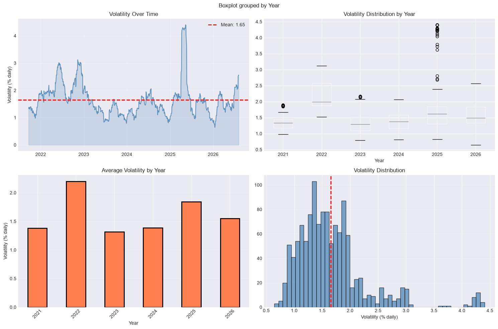
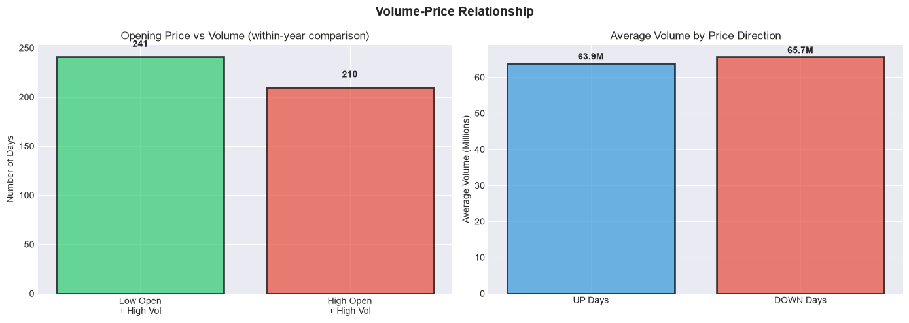
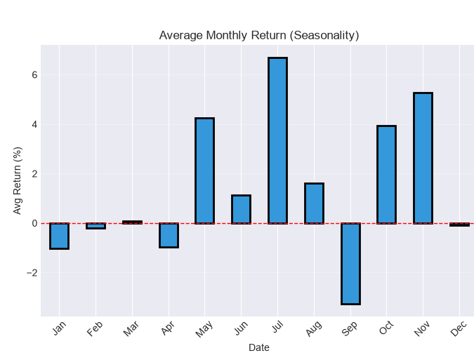
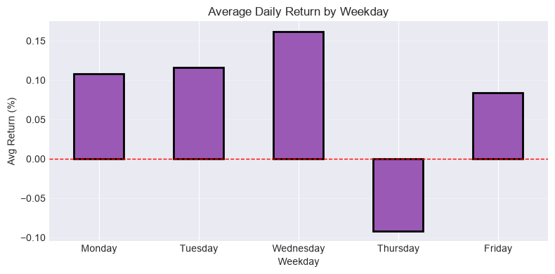
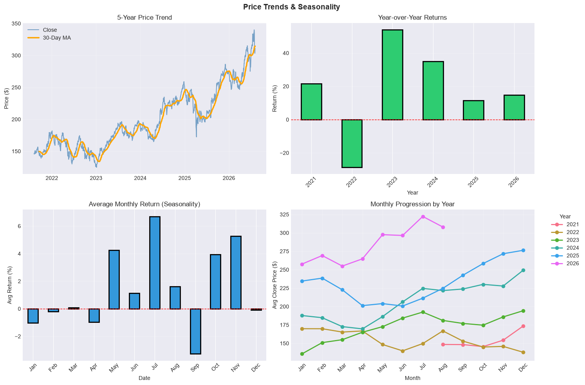
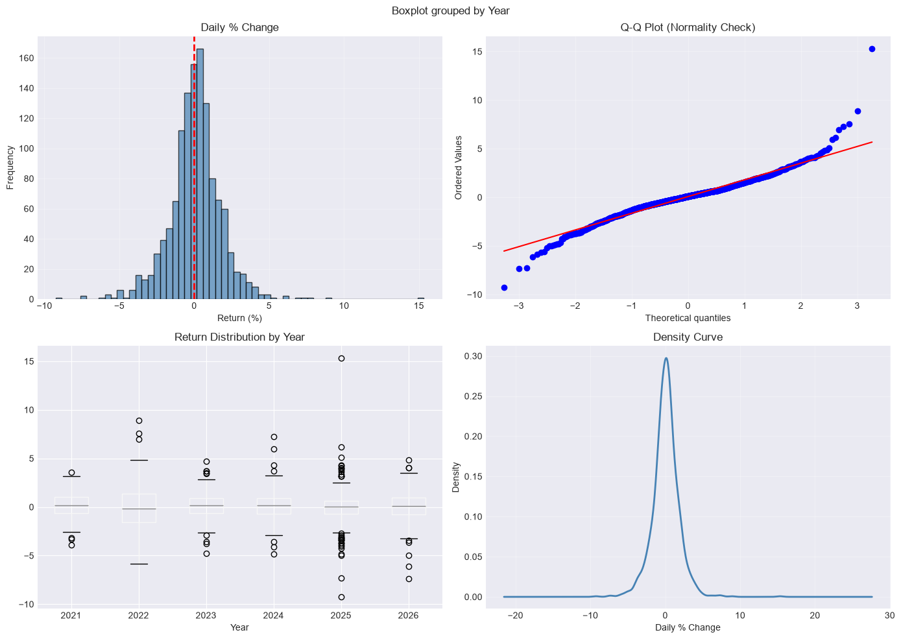
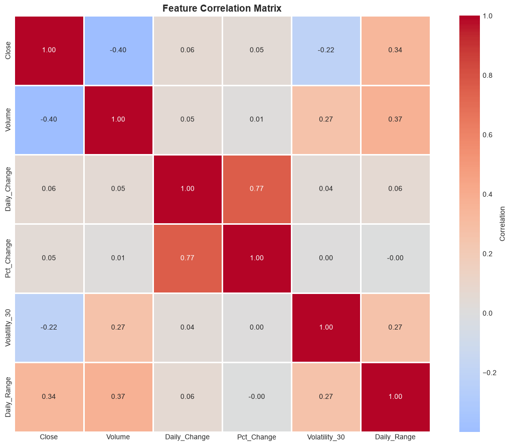
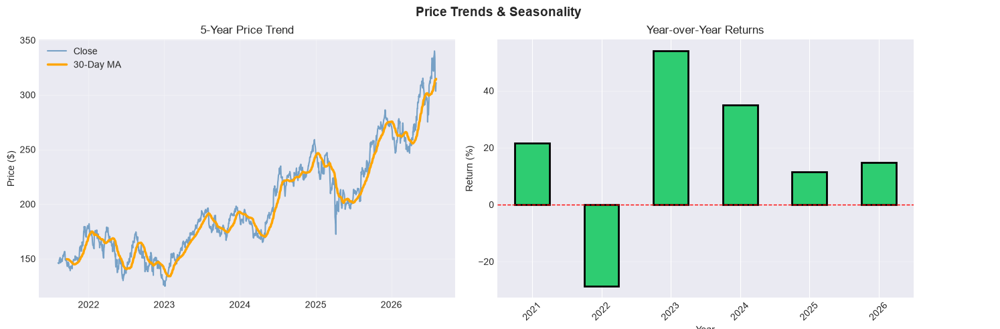

# 📈 Apple Stock Analysis (AAPL)

Statistical analysis of Apple Inc. (AAPL) stock market data, testing four common market assumptions and examining price movements and return distributions using five years of historical daily trading data.

---

## 📊 Hypotheses

This project investigates four common assumptions about stock market behavior:

1. **Higher stock price = Higher risk** — Does volatility increase as Apple's stock price rises?
2. **Volume predicts direction** — Does trading volume provide meaningful signals about subsequent price movements?
3. **Calendar patterns exist** — Do certain months or days of the week consistently exhibit different returns?
4. **Normal distribution assumption** — Do Apple's daily returns follow a normal distribution, as often assumed by traditional risk models?

Each assumption is tested using five years of Apple's historical daily market data to determine whether the observed evidence supports or challenges these common market beliefs.

---

## 📌 Context

Apple Inc. is one of the world's largest technology companies and among the most heavily traded stocks globally. Known for innovation in consumer electronics, software, and services, Apple maintains a strong market presence and consistent daily trading volume, making it ideal for statistical analysis across extended periods.

The **five-year study period** spans multiple market conditions, including the **post-pandemic bull market (2021)**, **rate-hike selloff (2022)**, and **subsequent recovery (2023-2026)**, providing a diverse environment for testing these market assumptions. Over the study period, Apple's stock price increased from **$146 to $311 (+112.8%, 16.3% CAGR)**, providing substantial variation in price levels and market behavior for statistical analysis.

---

## 📊 Data

| Attribute | Value |
|---|---|
| **Source** | Yahoo Finance (`yfinance`) |
| **Period** | August 2021 to August 2026 |
| **Observations** | 1,254 trading days |
| **Fields** | Date, Open, High, Low, Close, Adj Close, Volume |

This dataset contains **five years of Apple Inc.'s (AAPL) daily market data**, with each row representing one trading day and capturing opening price, intraday high and low, closing price, adjusted closing price, and trading volume. The dataset provides the foundation for analyzing volatility patterns, volume-price relationships, calendar effects, and return behavior.

**Derived measures:**
* **Daily returns** — Percentage change in closing price from one trading day to the next
* **Intraday range** — Difference between the daily high and low prices
* **30-day rolling volatility** — Rolling standard deviation of daily returns over 30 trading days
* **30-day moving average** — Rolling average of closing prices used to identify price trends

**Full documentation:** See the [Data Dictionary](DATA_DICTIONARY.md).

---

## ⚡ Key Results

| Hypothesis | Result | Finding |
|---|---|---|
| **Higher stock price = Higher risk** | ❌ Rejected | Percentage-based volatility remained relatively stable despite a 112.8% increase in price, suggesting dollar-denominated volatility can rise with price level without representing higher percentage risk. |
| **Volume predicts price direction** | ❌ Rejected | Trading volume on days with price increases and days with price decreases was not statistically different (**p = 0.267**), providing no evidence that volume predicts price direction. |
| **Calendar patterns exist** | ⚠️ Inconclusive | Calendar-based return patterns appeared in some periods but varied across years, providing insufficient evidence of a consistent seasonal effect. |
| **Returns follow a normal distribution** | ❌ Rejected | Daily returns exhibited substantial excess kurtosis (**6.64**), indicating heavier tails and more extreme movements than expected under a normal distribution. |

---

## 📈 Findings

### 1. Does higher stock price correspond to higher risk?

**Hypothesis:** Stock risk increases proportionally as price appreciates.

**Method:** Calculated 30-day rolling volatility as percentage returns across five years.

**Result:** Rejected. Average daily volatility: **1.65%**. Peak year (2022): 2.20%; lowest years (2023-2024): 1.3-1.4%. During this period, price rose from $146 to $311 (+112.8%), yet volatility showed no upward trend. Current volatility aligns with five-year mean despite 112.8% price appreciation.

A 30-day spike in early 2025 reached 4.4% (the highest in the sample), but 2025's median daily movement remains below the five-year average at 1.61%. This spike represents an isolated shock, not a shift in baseline risk.

**Key Insight:** Dollar-denominated volatility rises with price level automatically (a $300 stock moving $5/day appears higher than a $150 stock moving $2.50/day). Correcting to percentage returns eliminates the apparent trend. Occasional spikes occur but do not alter the underlying stability. A stock that doubles in price need not double in risk.



---

### 2. Does trading volume predict price direction?

**Hypothesis:** Volume differentials between days with price increases and days with price decreases signal directional strength.

**Method:** Two-sample t-test comparing mean volume on days with price increases versus days with price decreases.

**Result:** **Rejected.** Up-day volume: **63.9M shares**; down-day volume: **65.7M shares**. The difference was not statistically significant (**p = 0.267**). The correlation between daily returns and volume was also near zero (**r = 0.01**).

**Key Insight:** The analysis found no statistically significant difference in average trading volume between up-days and down-days. Within this dataset, volume therefore provides little evidence of a consistent relationship with daily price direction. The slightly higher average volume on down-days is not statistically significant and should not be interpreted as a directional signal.



---

### 3. Do seasonal patterns in returns exist?

**Hypothesis:** Certain months or weekdays exhibit superior average returns (calendar anomalies).

**Method:** Aggregated returns by month and weekday across the five-year period.

**Result:** Patterns appear weakly (July: **+6.7%**, September: **-3.3%**), but are inconsistent across individual years. While July shows the strongest overall return, it is not the top month in every year. The monthly ranking shifts year to year, suggesting the aggregate pattern reflects this specific five-year window rather than a repeatable seasonal effect. Weekday effects are negligible (**-0.09% to +0.16%**), roughly one-sixth of Apple's typical 1.65% daily volatility.

**Monthly patterns:** July and November show positive returns (+6.7% and +5.3%) when aggregated across all five years, while September is weakest (-3.3%). However, examining year-by-year progression reveals that the best-performing month varies. This inconsistency suggests that adding more years of data would likely shift the overall monthly ranking. The current patterns are observations of this period, not predictive insights.

**Weekday patterns:** The range of -0.09% (Thursday) to +0.16% (Wednesday) shows no weekday demonstrates consistent outperformance or underperformance.

**Key Insight:** Calendar patterns exist in this five-year sample but are weak and unstable. The top-performing month overall is not consistently the top performer in each individual year. Extended observation across additional years would be needed to determine if true seasonal patterns exist or if current patterns are coincidental to this period.







---

### 4. Do returns follow the normal distribution assumed in risk models?

**Hypothesis:** Daily returns follow a normal (bell curve) distribution.

**Method:** Applied D'Agostino normality test with Q-Q plot analysis.

**Result:** **Rejected (p < 0.001).** Returns exhibit **kurtosis of 6.64**, meaning extreme daily moves occur far more frequently than a normal distribution predicts.

The Q-Q plot (top-right of the visualization) shows sharp divergence at both tails, providing clear evidence that days that a normal model would classify as near-impossible happened regularly.

**Key Insight:** Standard risk models that assume normal distribution systematically underestimate extreme move frequency. With 1.65% average daily volatility, Apple experiences days outside **±3 standard deviations multiple times per year**. These are events that normal models classify as "impossible," yet they occur regularly. This has critical implications for value-at-risk calculations, option pricing, and portfolio hedging strategies built on normality assumptions.



---

## Additional Market Characteristics

Beyond the four hypothesis tests, two observational findings reveal important market patterns.

### 5. Why does volume decline while price appreciates?

**Observation:** Average daily volume fell **39%** (**85M → 51M** shares) while price rose **112.8%**.

**Apparent Finding:** Correlation between closing price and volume is **-0.40**, suggesting an inverse relationship.

**Actual Finding:** Correlation between daily returns and volume is **0.01** (unrelated). Looking at the correlation matrix, closing price to volume shows **-0.40** (bottom-left), but daily returns to volume shows only **0.01**. The -0.40 reflects opposing time trends, not a true negative relationship between price level and trading activity.

**Key Insight:** Volume decline and price appreciation are independent trends, not causally related. Both variables changed over the five-year period for separate reasons—price rose due to strong Apple performance, while volume fell due to lower volatility and reduced trading activity. The -0.40 correlation is a misleading artifact of these opposing time trends. The actual relationship between volume and daily price movement is near zero (r = 0.01), confirming they are unrelated.



---

### 6. How did Apple's stock price and returns progress over the period?

**Observation:** Apple appreciated **112.8%** (**$146 to $311**) with a **16.3% CAGR**.

**Yearly progression breakdown:**

| Year | Return | Market Regime | Notes |
|---|---|---|---|
| 2021 | **+20.7%** | Post-pandemic bull | Partial year (5 months) |
| 2022 | **-28.6%** | Rate-hike selloff | Highest loss in sample |
| 2023 | **+52.9%** | Recovery begins | Strongest year; breaks negative streak |
| 2024 | **+35.8%** | Momentum continues | Steady gains |
| 2025 | **+10.7%** | Normalizing | Growth moderates |
| 2026 | **+15.3%** | Steady growth | Partial year (7 months) |

**Key Insight:** The overall 112.8% appreciation masks substantial year-to-year variation. The period included a 28.6% decline in 2022, followed by strong gains in 2023 and 2024. This demonstrates that long-term price appreciation can coexist with substantial intermediate drawdowns and varying market regimes.



---

## 💡 Conclusions

Market insights depend critically on measurement methodology, not market behavior. Three widely-held assumptions failed empirical testing, revealing that measurement choices drive conclusions.

* **Volatility measurement:** Using dollars instead of percentages creates the false impression of rising risk. Correction reverses the conclusion.
* **Volume relationships:** Trading volume showed no statistically significant difference between days with price increases and days with price decreases, with correlation between daily returns and volume near zero.
* **Calendar effects:** Monthly and weekday patterns appeared in the sample but were unstable across years, providing insufficient evidence of a persistent seasonal effect.
* **Correlation methodology:** The negative correlation between closing price and volume may largely reflect opposing time trends, while correlation between returns and volume was effectively zero.
* **Distributional assumptions:** Apple's daily returns significantly deviated from normality and exhibited heavy tails, highlighting the limitations of assuming a normal distribution when modeling extreme movements.

Overall, the analysis reinforces an important principle: statistical conclusions depend not only on the data, but also on how variables are defined, measured, and tested.

---

## 📁 Project Structure

```
aapl-stock-analysis/
├── images/                 # Exported charts (8 visualizations)
├── Apple_Inc.ipynb         # Full analysis notebook with code and outputs
├── DATA_DICTIONARY.md      # Metric definitions, formulas, and caveats
└── README.md               # Project overview and findings
```

---

## 🧰 Tech Stack

- **Language:** Python
- **Libraries:** pandas, NumPy, SciPy, Matplotlib, Seaborn, yfinance
- **Environment:** Jupyter Notebook

---

## 🔄 Methodology

**1. Data Acquisition**
- Retrieved 1,254 daily OHLCV records; verified 0 missing values and 0 duplicates
- Used unadjusted `Close` for daily price behavior analysis

**2. Feature Engineering**
- Daily returns, intraday range, 30-day moving average, 30-day rolling volatility (% returns)
- Percentage-based metrics ensure comparability across the five-year period

**3. Hypothesis Testing**
- D'Agostino normality test on returns
- Two-sample t-test for volume (days with price increases versus days with price decreases)
- Pearson correlation for relationship analysis

**4. Time-Based Analysis**
- Yearly returns, monthly seasonality (within-year and aggregated), weekday averages

---

## ⚠️ Limitations

- **No benchmark:** Returns are measured in absolute terms. No comparison to S&P 500 or NASDAQ is provided to contextualize performance relative to the broader market.
- **Dividends excluded:** Actual shareholder return exceeded 112.8% when accounting for dividend payments. Analysis focuses on price behavior only.
- **Partial years:** 2021 covers 5 months; 2026 covers 7 months. Annual returns for these years are not directly comparable to full-year periods.
- **Period-specific insights:** Analysis is based on historical data (Aug 2021 to Aug 2026). As market structures and conditions evolve, findings may not hold in future periods. Results describe observed behavior during this specific window, not necessarily predictive patterns.

*This analysis is informational only and should not be construed as investment advice.*

---

## 🧑‍💻 Author

**Thrinesh Vuribindi** — Data Analyst

[](https://www.linkedin.com/in/thrineshvuribindi)
[](https://github.com/thrinesh13)
